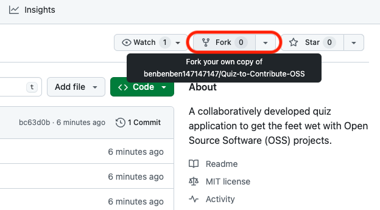
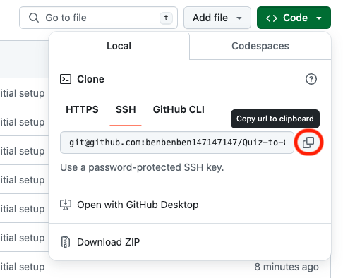

## First Contribution Tutorial

Ready to make your first contribution to a Open Source project?

This tutorial will guide you through the whole process step by step.

#### Guide

1. Create a fork of this repository. This will be your personal copy if this project.
<div align="center">

</div>

2. Next, clone (copy) your fork on your local machine. Therefore, copy the web URL of your newly created fork.

<div align="center">

</div>

3. Open a terminal on your machine and execute the following command (this will download your fork into the current location on your machine):
```
git clone <your-web-url>
```
4. Navigate into the downloaded fork:
```
cd Quiz-to-Contribute-OSS
```
5. Typically GitHub repositories have main branch protection rules employed. Therefore, you need to merge your changes via a "Pull Request (PR)" into the main branch. For that, create a new branch (note that switch is a rather new way of creating a new branch):
```
git switch -c <branch-name>
```
6. Now you are ready to make your changes in the code base.
7. In the [list_of_contributors](LIST_OF_CONTRIBUTORS.md) file, add your name and a link to your GitHub profile.
8. Once you are done, you can add, commit, and push your changes to your remote fork (make sure to follow the commit message conventions from [here](https://gist.github.com/qoomon/5dfcdf8eec66a051ecd85625518cfd13)):
```
git add .
git commit -m "docs: <insert-meaningful-message>"
git push -u origin <branch-name>
```
8. In GitHub, you should now see the message, that you have pushed a new commit. Click on "Create Pull Request" to request your changes to be merged into the main branch.
9. I will now check your PR and approve it, if everything looks fine. Otherwise, I will write a comment on your PR thread to resolve the issue with you together.
10. Now, your changes are in the main branch.


**🎈 You have successfully completed your first contribution! 🎈**


If you want, you can proceed with Level 2️⃣🌟 - [Contribute](https://github.com/benbenben147147147/Quiz-to-Contribute-OSS/blob/main/CONTRIBUTE_LEVEL_2.md)